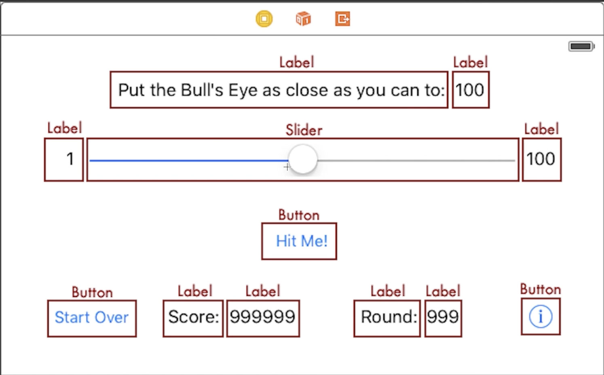
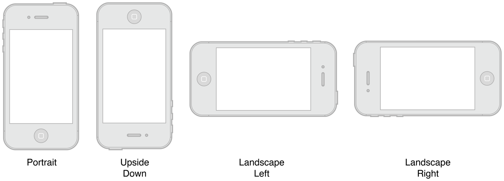
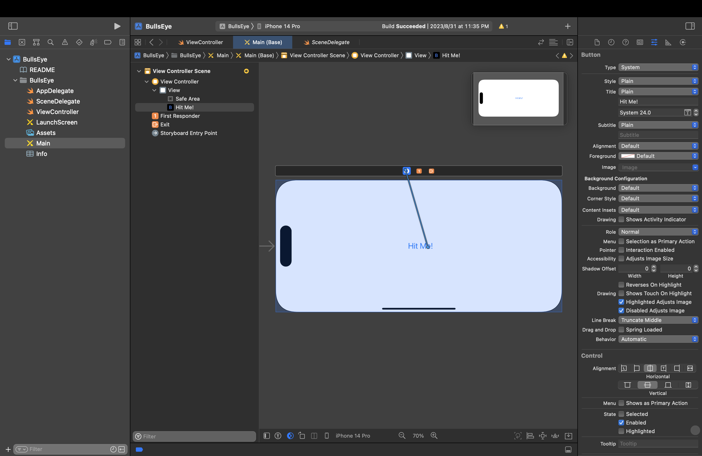

# 3-2. UIKit App and Storyboard

## Xcode 檔案結構

- Info.plist
  - 產品的設定檔
  - 向 iOS 說明產品的特性，如：支援的裝置、支援的方向、支援的版本、產品的名稱、圖示、啟動畫面、權限等等

- Assets.xcassets
  - 產品的圖片資源，如：圖示、啟動畫面、按鈕圖片等等

- ViewController.swift
  - 負責畫面的顯示

- AppDelegate.swift
  - 產品啟動時，會先執行 AppDelegate.swift 的程式碼
  - 負責應用程序的生命週期和設置

- SceneDelegate.swift
  - 負責螢幕上顯示的內容（窗口 Windows 或場景 Scene）處理並管理您的應用程序的顯示方式

- Main.storyboard
  - 產品的畫面設計

- LaunchScreen.storyboard
  - 產品啟動時，顯示的畫面，參考[這篇](https://www.jianshu.com/p/13fdc6a3cd41)

## 快捷鍵

- 代碼補全 - `esc`
- 文件查詢 - `option + click`
- Run - `command + R`
- Build - `command + B`
- 新增元件 - `command + shift + L` 後將元件拖曳到畫面中
- 連動元件 - 按住 `control` 拖曳
- 自動調整 - `command + =`

## TODO List

- `Hit Me!` **button**
  - 讀取 slider value
  - 計算得分
  - 顯示彈窗
  - 更新 `score` and `round` labels
  - 更新 `targetValue` label
- `slider` **slider**
- `minimumValue` **label**
- `maximumValue` **label**
- `target`
  - `targetTitle` **label**
  - `targetValue` **label**
- `score`
  - `scoreTitle` **label**
  - `scoreValue` **label**
- `round`
  - `roundTitle` **label**
  - `roundValue` **label**
- `info` **button**
  - 顯示說明頁面
- `startOver` **button**
  - 重置 `score` and `round`
  - 重置 `slider`
  - 重置 `targetValue`
  - 重置 `round`



## 設置方向

- Portrait
- Upside Down
- Landscape Left
- Landscape Right



- 點擊專案
- `General` 頁籤
- 在 `Deployment Info` 中選擇支援的方向。

## 初始程式碼解析

- `.swift` 之於 `.storyboard`，就像是 `.js` 之於 `.html`
  - 事實上，`.storyboard`的原始碼和 `.html` 很像，都是使用 `XML` 語法
- 我們能在 `.storyboard` 中設計畫面，而在 `.swift` 檔中設計功能

下面是 `ViewController.swift` 預設的程式碼，我們可以在這裡新增其他程式碼。

```swift
import UIKit

class ViewController: UIViewController {
    override func viewDidLoad() {
        super.viewDidLoad()
    }

    // 在這裡新增其他程式碼
}
```

- `import UIKit` - 導入 UIKit 框架
  - `import` - 導入，用來導入其他框架或模組
  - UIKit - 用於開發 iOS 和 tvOS 應用程序的框架

  ---

- `class ViewController: UIViewController`
  - 建立一個類別 `ViewController`，並且繼承 `UIViewController` 這個類別
  - `class` - 代表這是一個類別
  - `ViewController` - 類別的名稱
  - `UIViewController` - 用於管理和協調視圖的顯示

- `ViewController` 類別表示一種我們建構畫面功能的方式，所以如果有許多畫面要求的功能一樣的時後，都可以連結至同一個 `ViewController` 類別。

  ---

- `override func viewDidLoad()`
  - 覆寫 `UIViewController` 中的 `viewDidLoad()` 函式，這個函式代表畫面載入完成後，會執行的程式碼
  - `override` - 覆寫，通常用於某些函式已經有預設的功能，但是我們需要改寫這個函式的功能時，就可以使用 `override`
  - `func` - 代表這是一個函式
  - `viewDidLoad()` - 函式的名稱

## 按鈕與動作 Button and Action

- `Main.storyboard` 中新增 button
- 在 `ViewController.swift` 中添加程式碼
  
```swift
@IBAction func showAlert() {
    print("Hello World!")
}
```

- `@IBAction` - 代表這個 function 是由 `Main.storyboard` 中的元件觸發

  ---

- `print` - 將文字顯示在 `Console` 中

  ---



- `Main.storyboard` 中按住 `control` 並將 button 拖曳到上方 `ViewController`
- 選取 `showAlert()`
- 右邊欄找到 `Connections Inspector` 可以看到 `showAlert()` 與 `Touch Up Inside` 連動，也有其他的 `Event` 可以選擇

## 彈窗 Alerts

我們可以改寫上面的代碼，讓 `showAlert()` 可以顯示彈窗。

```swift
@IBAction func showAlert() {
    var message = "The value of the slider is now: \(sliderValue)"
    let alert = UIAlertController(title: "Hello, World!",
                                  message: message,
                                  preferredStyle: .alert)
    let action = UIAlertAction(title: "OK",
                               style: .default,
                               handler: nil)
    alert.addAction(action)
    present(alert, animated: true, completion: nil)
}
```

- `UIAlertController` - 建立彈窗
  - `title` - 彈窗的標題
  - `message` - 彈窗的內容
  - `preferredStyle` - 彈窗的樣式
    - `.alert` - 一般的彈窗
    - `.actionSheet` - 顯示在畫面底部的彈窗

  ---

- `UIAlertAction` - 建立彈窗的按鈕
  - `title` - 按鈕的標題
  - `style` - 按鈕的樣式
    - `.default` - 一般的按鈕
    - `.cancel` - 取消按鈕
    - `.destructive` - 刪除按鈕
  - `handler` - 按下按鈕後要執行的程式碼
    - `nil` - 不執行任何程式碼

  ---

- `alert.addAction(action)` - 將按鈕加入彈窗

  ---

- `present(alert, animated: true, completion: nil)` - 顯示彈窗
  - `animated` - 是否要有動畫
  - `completion` - 顯示後要執行的程式碼
    - `nil` - 不執行任何程式碼

## 滑桿 Sliders

- `Main.storyboard` 中添加 slider
- 右側面板打開 `Attriubte Indicator`，可以看到 `Minimum`、`Maximum`、`Value` 等等的屬性
  - `Minimum` - 滑桿的最小值
  - `Maximum` - 滑桿的最大值 - 設定為 100
  - `Value` - 滑桿的初始值 - 設定為 50
- 在 `ViewController.swift` 中添加程式碼
  
```swift
@IBAction func sliderMoved(_ slider: UISlider) {
    print("The value of the slider is now: \(slider.value.rounded())")
}
```

- `Main.storyboard` 中將滑桿連動至 `sliderMoved(_:)`

---

- `(_ slider: UISlider)` - 代表這個 function 需要傳入 `slider` 這個參數
  - `_` - 代表外部呼叫時不需要傳入參數名稱
    - 例如：`sliderMoved(mySlider)`
    - 若沒有 `_` 則需要傳入參數名稱，例如：`sliderMoved(slider: mySlider)`
  - `slider` - 代表內部使用時的參數名稱
  - `UISlider` - 代表這個參數需要是 `UISlider` 這個類別的物件

  ---

- `print` - 將文字顯示在 `Console` 中
  - `"\(變數)"` - 將變數放嵌入字串中
  - `slider.value` - 取得 `slider` 的數值
    - `.rounded()` - 四捨五入

### 顯示 `slider` 的數值

- 方法一：將 `slider` 的數值存到變數中，並透過`sliderMoved(_:)`更新變數的值

```swift
var sliderValue: Int = 50

@IBAction func showAlert() {
    let message = "The value of the slider is now: \(sliderValue)"
    let alert = UIAlertController(title: "Hello, World!",
                                  message: message,
                                  preferredStyle: .alert)
    let action = UIAlertAction(title: "Awesome",
                               style: .default,
                               handler: nil)
    alert.addAction(action)
    present(alert, animated: true, completion: nil)
}

@IBAction func sliderMoved(_ slider: UISlider) {
    sliderValue = Int(slider.value.rounded())
    print("The value of the slider is now: \(sliderValue)")
}
```

  ---

- 方法二：建立 `@IBOutlet` 物件

我們先在 `ViewController.swift` 中建立 `@IBOutlet` 物件，並且在 `Main.storyboard` 中連動。

```swift
@IBOutlet weak var slider: UISlider!
```

- `@IBOutlet` - 代表這個變數是由 `Main.storyboard` 中的元件連動
  - `weak` - 代表這個變數是弱參照，當 `Main.storyboard` 中的元件被刪除時，這個變數會自動設定為 `nil`
  - `var slider: UISlider!` - 代表這個變數是 `UISlider` 類別的物件，並且可以是 `nil`
    - `!` - 代表這個變數可以是 `nil`
    - `?` - 代表這個變數可以是 `nil`，但是在使用時需要先判斷是否為 `nil`

---

- 在 `Main.storyboard` 中找到 `Connections Inspector`
- 選取 `slider` 並將 `Referencing Outlets` 拖曳到 `ViewController` 上

---

然後建立一個函式，可以取得 `slider` 的數值。

```swift
func getSliderValue () -> Int {
    return Int(slider.value.rounded())
}
```

- `Int(...)` - 將 `slider.value.rounded()` 轉換成 `Int`

---

最後在 `showAlert()` 中使用 `getSliderValue()` 取得 `slider` 的數值。

```swift
@IBAction func showAlert() {
    let message = "The value of the slider is now: \(getSliderValue())"
    let alert = UIAlertController(title: "Hello, World!",
                                  message: message,
                                  preferredStyle: .alert)
    let action = UIAlertAction(title: "Awesome",
                               style: .default,
                               handler: nil)
    alert.addAction(action)
    present(alert, animated: true, completion: nil)
}
```

## 標籤 Label

### 建立 `@IBOutlet`


```swift
@IBOutlet weak var slider: UISlider!
@IBOutlet weak var targetLabel: UILabel!
@IBOutlet weak var scoreLabel: UILabel!
@IBOutlet weak var roundLabel: UILabel!
```

記得在 `main.storyboard` 中，將 `Referencing Outlets` 連動至 `ViewController`

### 建立變數

```swift
var targetValue: Int = 0
var score: Int = 0
var round: Int = 0
```

### 更新文字 - `updateLabels()`

```swift
func updateLabels() {
    targetLabel.text = String(targetValue)
    scoreLabel.text = String(score)
    roundLabel.text = String(round)
}
```

- `targetLabel.text`
  - `targetLabel` - 我們前面建立的 `@IBOutlet` `UILabel`
  - `.text` - `UILabel` 的屬性，代表 `UILabel` 的文字內容
- `String(...)` - 將數值轉換成字串
  - 由於 `targetLabel.text` 是 `String`，`targetValue` 是 `Int`，所以需要轉換成 `String` 才能指定給 `targetLabel.text`

## 建立按紐 - `startOver` **button**

### 功能 - `reset()`

我們希望按下 `startOver` **button** 後

- 重置 `score` and `round`
- 重新開始遊戲。

```swift
@IBAction func reset() {
    score = 0
    round = 0
    startNewRound() // 重新開始遊戲的函式，後面會進行實作
}
```

我們先將 `reset()` 連動至 `startOver` **button**。

### 開始新遊戲 - `startNewRound()`

我們會希望每一輪新的遊戲，都會重新設定 `slider` 的數值，並重新設定 `targetValue` 的值，並且更新所有 Label 的數值。

```swift
func startNewRound() {
    slider.value = 50
    randomizeTarget() // 重新設定 targetValue 的值
    updateLabels() // 更新所有 Label 的數值
}
```

### 隨機生成目標值 - `randomizeTarget()`

我們希望每一輪新的遊戲，`targetValue` 的值都會重新設定。

```swift
func randomizeTarget() {
    targetValue = Int.random(in: 1...100)
}
```

- `Int.random(in: 1...100)` - 產生 1 到 100 之間的隨機整數

### 啟動 app

由於我們希望每次啟動 app 時，都會重新開始遊戲，所以我們需要在 `AppDelegate.swift` 中預設的 `viewDidLoad` 中呼叫 `reset()`。

```swift
override func viewDidLoad() {
    super.viewDidLoad()
    
    reset()
}
```

## 建立按紐 - `Hit Me!` **button**

### 功能 - `showAlert()`

我們希望按下 `Hit Me!` **button** 後

- 計算 `slider` 與 `targetValue` 的差值
- 計算得分
- 顯示彈窗
  - 彈窗的標題會根據差值產生
  - 彈窗的內容會根據得分產生
  - 關閉彈窗後重新開始遊戲
- 更新 `score` and `round`

```swift
@IBAction func showAlert() {
    let diff = calculateDifference()
    let scoredThisRound = calculateScores(difference: diff)
    let title = generateTitle(diffrence: diff)
    let message = generateMessage(scored: scoredThisRound)
    
    score += scoredThisRound // 更新 score
    round += 1 // 更新 round
    
    let alert = UIAlertController(title: title,
                                  message: message,
                                  preferredStyle: .alert)
    
    let action = UIAlertAction(title: "Awesome",
                               style: .default,
                               handler: {_ in self.startNewRound()})
    
    alert.addAction(action)
    
    present(alert, animated: true, completion: nil)
}
```

- `let diff = calculateDifference()` - 計算 `slider` 與 `targetValue` 的差值
- `let scoredThisRound = calculateScores(difference: diff)` - 根據差值計算得分
- `let title = generateTitle(diffrence: diff)` - 彈窗的標題會根據差值產生

- `let message = generateMessage(scored: scoredThisRound)` - 彈窗的內容會根據得分產生

  ---

- `score += scoredThisRound` - 更新 `score`
  - `+=` - 相當於 `score = score + scoredThisRound`

- `round += 1` - 更新 `round`

  ---

- `UIAlertAction` - 關閉彈窗
  - `handler` - 按下按鈕後要執行的程式碼
  - `{_ in self.startNewRound()}` - 代表按下按鈕後執行 `startNewRound()` 這個函式
    - `{_ in ...}` - 閉包 closure
    - 在閉包中使用其他函式時，需要加上 `self.`，例如：`self.startNewRound()`，這個概念會在物件中提到

### 計算差值 - `calculateDifference()`

```swift
func calculateDifference() -> Int {
    let difference = targetValue - getSliderValue()
    return abs(difference)
}
```

- `abs()` - 取絕對值

### 計算得分 - `calculateScores(difference: Int)`

我們希望差值越小，得分越高，所以我們可以用 `100 - 差值` 來計算得分。

```swift
func calculateScores(difference: Int) -> Int {
    return 100 - difference
}
```

### 生成彈窗標題 - `generateTitle(diffrence: Int)`

我們希望根據差值產生彈窗的標題

- 差值為 0 - `"Perfect!"`
- 差值小於 5 - `"You almost had it!"`
- 差值小於 10 - `"Pretty good!"`
- 其他 - `"Not even close..."`

我們有三種方式：

- `if` - `else`

```swift
func generateTitle(diffrence: Int) -> String {
    if diffrence == 0 {
        return "Perfect!"
    } else if diffrence < 5 {
        return "You almost had it!"
    } else if diffrence < 10 {
        return "Pretty good!"
    } else {
        return "Not even close..."
    }
}
```

- `switch`

```swift
func generateTitle(diffrence: Int) -> String {
    switch diffrence {
    case 0:
        return "Perfect!"
    case 1..<5:
        return "You almost had it!"
    case 5..<10:
        return "Pretty good!"
    default:
        return "Not even close..."
    }
}
```

- 三元運算子

```swift
func generateTitle(diffrence: Int) -> String {
    return diffrence == 0 ? "Perfect!" :
           diffrence < 5 ? "You almost had it!" :
           diffrence < 10 ? "Pretty good!" :
           "Not even close..."
}
```

以上三種方式都是等價的，可以自行選擇。

### 生成彈窗內容 - `generateMessage(scored: Int)`

我們希望出來的結果如下：

```plain
The target is *50*.
Your guess is *50*.
You scored *100* points this round.
```

用星號括起來的部分，是我們需要根據 `targetValue`、`slider` 的數值、得分來產生的。

```swift
func generateMessage(scored n: Int) -> String {
    return "The target is \(targetValue).\n" +
    "Your guess is \(getSliderValue()).\n" +
    "You scored \(n) points this round."
}
```

- `\n` - 換行
- `+` - 字串相加

## 完整程式碼

```swift
//
//  ViewController.swift
//  BullsEye
//
//  Created by chen shen yi on 2023/8/30.
//
import UIKit

class ViewController: UIViewController {
    override func viewDidLoad() {
        // 這個是當 view 被載入時，會執行的 function
        
        super.viewDidLoad() // 呼叫父類別的 viewDidLoad
        
        reset()
    }
    
    // MARK: IBOutlet Objects

    @IBOutlet var slider: UISlider!
    @IBOutlet var targetLabel: UILabel!
    @IBOutlet var scoreLabel: UILabel!
    @IBOutlet var roundLabel: UILabel!
    
    var targetValue: Int = 0
    var score: Int = 0
    var round: Int = 0
    
    func getSliderValue() -> Int {
        return Int(slider.value.rounded())
    }
    
    func updateLabels() {
        targetLabel.text = String(targetValue)
        scoreLabel.text = String(score)
        roundLabel.text = String(round)
    }
    
    // MARK: Restart Button

    @IBAction func reset() {
        score = 0
        round = 0
        startNewRound()
    }
    
    func startNewRound() {
        slider.value = 50
        randomizeTarget()
        updateLabels()
    }
    
    func randomizeTarget() {
        targetValue = Int.random(in: 1 ... 100)
    }
    
    // MARK: ClickMe! Button

    @IBAction func showAlert() {
        let diff = calculateDifference()
        let scoredThisRound = calculateScores(difference: diff)
        let title = generateTitle(diffrence: diff)
        let message = generateMessage(scored: scoredThisRound)
        
        score += scoredThisRound
        round += 1
        
        let alert = UIAlertController(title: title,
                                      message: message,
                                      preferredStyle: .alert)
        
        let action = UIAlertAction(title: "Awesome",
                                   style: .default,
                                   handler: { _ in self.startNewRound() })
        
        alert.addAction(action)
        
        present(alert, animated: true, completion: nil)
    }
    
    func calculateDifference() -> Int {
        let difference = targetValue - getSliderValue()
        return abs(difference)
    }
    
    func calculateScores(difference: Int) -> Int {
        return 100 - difference
    }
    
    func generateTitle(diffrence: Int) -> String {
        return diffrence == 0 ? "Perfect!" :
            diffrence < 5 ? "You almost had it!" :
            diffrence < 10 ? "Pretty good!" :
            "Not even close..."
    }
    
    func generateMessage(scored n: Int) -> String {
        return "The target is \(targetValue).\n" +
            "Your guess is \(getSliderValue()).\n" +
            "You scored \(n) points this round."
    }
}
```

## 建立按紐 - `info` **button**

### 建立新的 `ViewController`

- `File` -> `New` -> `File...` -> `Cocoa Touch Class`
  - `name: AboutViewController`
  - `subclass of: UIViewController`
  - `language: Swift`
- `Next` -> `Create` (確認 `Targets` 中有勾選 `BullsEye`)

- `Main.storyboard` 中新增 `ViewController`
- `Identity Inspector` 中將 `Class` 設定為 `AboutViewController`

### 連動

- `Main.storyboard` 中按住 `control` 並將 `info` **button** 拖曳到 `AboutViewController`
- 選取 `modal`，這樣按下 `info` **button** 後，會跳出 `AboutViewController` 的畫面

### 關閉說明頁 - `close()`

我們需要在建立一個關閉說明頁的窗口，所以我們需要在 `AboutViewController.swift` 中建立 `@IBAction func close()`，並且在 `Main.storyboard` 中連動。

```swift
//
//  AboutViewController.swift
//  BullsEye
//
//  Created by chen shen yi on 2023/9/3.
//

import UIKit

class AboutViewController: UIViewController {
    override func viewDidLoad() {
        super.viewDidLoad()
    }
    
    @IBAction func close() {
        dismiss(animated: true, completion: nil)
    }
}
```

- `dismiss(animated: true, completion: nil)` - 關閉說明頁的窗口
  - `animated` - 是否要有動畫
  - `completion` - 關閉後要執行的程式碼
