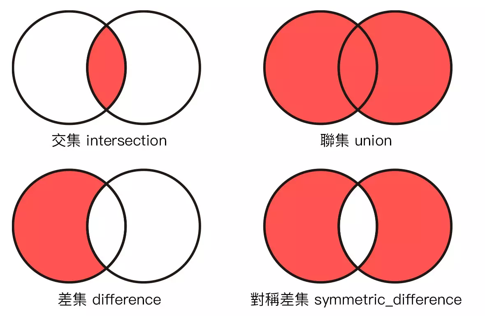

# More Collections

## 字典 Dictionary

- 字典是一個**可變更長度**無序容器，透過 `Key` 取得 `Value`，可以包含指定類型的資料。
- 值可以重複，但鍵必須唯一。
- 用 `[KeyType: ValueType]` 來表示型別。

```swift
var legs: [String: Int] = [
  "fish": 0,
  "spider": 8,
  "dog": 4,
  "cat": 4,
  "ant": 6,
  "human": 2
]

print(legs["fish"]!) // 0
```

- 需要注意的是，字典的值是**可選型別**，因此取值時需要加上驚嘆號 `!`。
  - 因為字典的鍵可能不存在。

  ---

我們可以用 `[:]` 來建立空字典，此時型別不會被推斷，因此需要指定型別：

```swift
var legs: [String: Int] = [:]
```

### `.updateValue(_:, forKey:)`

- 更新字典的值，若鍵不存在，則新增一組鍵值對。

```swift
var legs: [String: Int] = [
  "fish": 0,
  "spider": 4, // 這裡先設為 4
  "dog": 4,
  "cat": 4,
  "ant": 6,
  "human": 2
]

legs.updateValue(8, forKey: "spider") // 更新為 8
print(legs["spider"]!) // 8
```

- 這裡的 `updateValue` 會回傳一個 `Int?`，代表更新前的值。
  - 若鍵不存在，則回傳 `nil`。

  ---

也可以直接指定鍵值對：

```swift
var legs: [String: Int] = [
  "fish": 0,
  "spider": 4, // 這裡先設為 4
  "dog": 4,
  "cat": 4,
  "ant": 6,
  "human": 2
]

legs["spider"] = 8 // 直接指定為 8
print(legs["spider"]!) // 8
```

### 當鍵不存在

- 當鍵不存在時，會回傳 `nil`。

```swift
var legs: [String: Int] = [
  "fish": 0,
  "spider": 8,
  "dog": 4,
  "cat": 4,
  "ant": 6,
  "human": 2
]

print(legs["bird"] ?? "What??") // What??
```

- 這裡使用 `??` 來處理 `nil` 的情況。
  - 因為 `"bird"` 不在字典中，所以會回傳 `nil`。
  - `??` 會判斷前面的值是否為 `nil`，若是，則回傳後面的值，因此這裡會回傳 `"What??"`。

## 用鍵值對迭代 Iterating over key-value pairs

- 透過 `for-in` 迴圈來迭代字典。

```swift
var legs: [String: Int] = [
  "fish": 0,
  "spider": 8,
  "dog": 4,
  "cat": 4,
  "ant": 6,
  "human": 2
]

for (animal, leg) in legs {
  print("\(animal) has \(leg) legs.")
}
```

- 這裡的 `for-in` 迴圈會回傳一個 `(String, Int)` 的 tuple。
  - 這裡的 `animal` 就是鍵，`leg` 就是值。

### 只取鍵或值

- 透過 `for-in` 迴圈，可以只取鍵或值。

```swift
var legs: [String: Int] = [
  "fish": 0,
  "spider": 8,
  "dog": 4,
  "cat": 4,
  "ant": 6,
  "human": 2
]

for animal in legs.keys {
  print(animal)
}
```

- 這裡的 `legs.keys` 會回傳 `["fish", "spider", "dog", "cat", "ant", "human"]` 的集合。

  ---

```swift
var legs: [String: Int] = [
  "fish": 0,
  "spider": 8,
  "dog": 4,
  "cat": 4,
  "ant": 6,
  "human": 2
]

for leg in legs.values {
  print(leg)
}
```

- 這裡的 `legs.values` 會回傳 `[0, 8, 4, 4, 6, 2]`的集合。

## 集合 Set

- 集合是一個**可變更長度**無序容器，可以包含指定類型的資料。

```swift
var animals: Set<String> = [
  "fish",
  "spider",
  "dog",
  "cat",
  "ant",
  "human"
]

print(animals) // ["human", "dog", "fish", "cat", "ant", "spider"]
```

- 我們會注意到，集合是無序的，因此每次列印出來的順序都不一樣。

### `contains(_:)`

- 透過 `contains(_:)` 來判斷集合中是否包含某個元素。

```swift
var animals: Set<String> = [
  "fish",
  "spider",
  "dog",
  "cat",
  "ant",
  "human"
]

print(animals.contains("bird")) // false
```

### `.insert(_:)`

- 透過 `.insert(_:)` 來新增元素。

```swift
var animals: Set<String> = [
  "fish",
  "spider",
  "dog",
  "cat",
  "ant",
  "human"
]

animals.insert("bird")
print(animals) // ["human", "dog", "fish", "cat", "ant", "spider", "bird"]
```

### `.remove(_:)`

- 透過 `.remove(_:)` 來移除元素。

```swift
var animals: Set<String> = [
  "fish",
  "spider",
  "dog",
  "cat",
  "ant",
  "human"
]

animals.remove("fish")
print(animals) // ["human", "dog", "cat", "ant", "spider"]
```

### `.union(_:)`

- $ A \cup B $
- 透過 `.union(_:)` 來合併兩個集合，並回傳一個新的集合，。
- 這裡的合併會產生一個新的集合，原本的集合不會被改變。

```swift
var animals: Set<String> = [
  "fish",
  "spider",
  "dog",
  "cat",
  "ant",
  "human"
]

var animals2: Set<String> = [
  "bird",
  "snake",
  "spider",
  "dog",
  "cat",
  "ant",
  "human"
]

print(animals.union(animals2)) // ["human", "dog", "fish", "cat", "ant", "spider", "bird", "snake"]
```

- 相似的，我們也可以用 `.intersection(_:)` 來取得兩個集合的交集 ( $ A \cap B $ )。
- `.subtracting(_:)` 來取得兩個集合的差集 ( $ A - B $ )。
- `.symmetricDifference(_:)` 來取得兩個集合的對稱差集 ( $ A \triangle B $ )。



### `.formUnion(_:)`

- 透過 `.formUnion(_:)` 來將兩個集合合併，並將結果儲存在第一個集合中。
- 這裡的合併會改變第一個集合。

```swift
var animals: Set<String> = [
  "fish",
  "spider",
  "dog",
  "cat",
  "ant",
  "human"
]

var animals2: Set<String> = [
  "bird",
  "snake",
  "spider",
  "dog",
  "cat",
  "ant",
  "human"
]

animals.formUnion(animals2)
print(animals) // ["human", "dog", "fish", "cat", "ant", "spider", "bird", "snake"]
```

- 相似的，我們也可以用 `.formIntersection(_:)` 來取得兩個集合的交集。
- `.formSubtract(_:)` 來取得兩個集合的差集。
- `.formSymmetricDifference(_:)` 來取得兩個集合的對稱差集。
